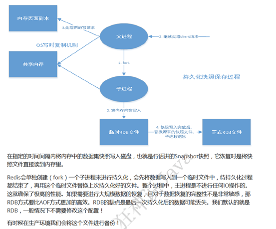
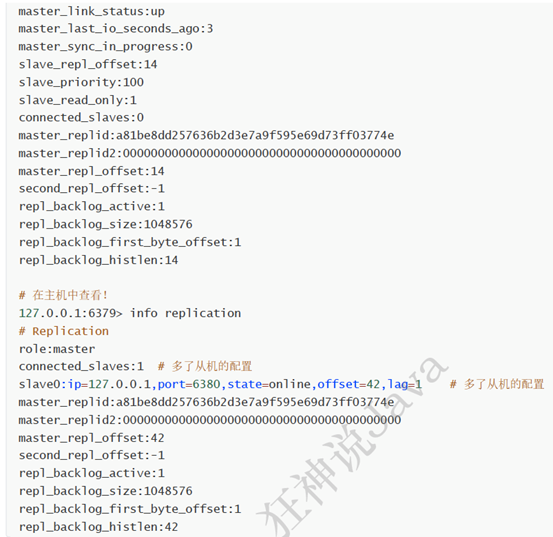

# 1. Spring

## 1.1 IoC

### 1.1.1 IoC是什么/好处

控制反转，实现对象间的解偶。

spring IoC， 对象的创建交由spring容器来完成。

IoC带来的好处：对象关系便于管理。

### 1.1.2 IoC原理

反射，可以根据类的全限定名在程序运行时创建对象，将类的全限定名配置在xml文件中，在程序运行时通过反射读取该类的全限定名，动态的创建对象。

Ioc容器可以自动的帮我们完成以上一系列操作，我们需要做的就是通过配置文件告诉ioc容器需要创建哪个类以及类和类之间的关系

### 1.1.3 IoC和DI

IoC是一种思想，依赖注入(DI)是这种思想的一种具体实现

依赖注入的两种方式：构造器注入和setter方法注入

### 1.1.4 spring Ioc循环依赖

#### 1.1.4.1 什么是循环依赖


#### 1.1.4.2 spring ioc怎么解决循环依赖

SpringIOC解决循环依赖的思路就是依靠**缓存**，同时还得引出个概念即**早期暴露引用**。

在IOC容器里bean的初始化的过程分为三个步骤：创建实例、属性注入实例、回调实例实现的接口方法。

解决思路：当创建实例与属性注入实例这两个步骤之间的时候，引入缓存，将这些已经创建好但是并没有注入属性的实例放到缓存里，

而这些放在缓存里但是没有被注入属性的实例对象，就是解决循环依赖的方法，打个比方：A对象的创建需要引用到B对

象，而B对象的创建也需要A对象，而此时当B对象创建的时候直接从缓存里引用A对象（虽然不是完全体A对象，毕竟没有赋值处理），当

B对象完成创建以后再被A对象引用进去，则A对象也完成了创建。

 这就是SpringIOC解决bean直接循环依赖的思路。当然有一个小问题，<font color='red'>IOC能够解决的只能是属性之间的循环依赖</font>，如果有bean

之间构造器相互依赖则就解决不了，只能报错了。

## 1.2 AOP

### 1.2.1 AOP是什么

 面向切面编程, <font color='red'>在程序运行期间将某段代码动态切入到指定方法的指定位置进行运行</font>。

### 1.2.2 AOP使用场景

日志（审计）、权限控制、安全检查、事务控制

### 1.2.3 spring aop的实现原理

动态代理

Spring AOP中的动态代理主要有两种方式，JDK动态代理和CGLIB动态代理。JDK动态代理通过反射来接收被代理的类，并且要求被代理

的类必须实现一个接口。JDK动态代理的核心是<font color='red'>InvocationHandler接口</font>和<font color='red'>Proxy类</font>。

 如果目标类没有实现接口，那么Spring AOP会选择使用CGLIB来动态代理目标类。CGLIB（Code Generation Library），是一个代码生

成的类库，可以在运行时动态的生成某个类的子类，注意，CGLIB是通过继承的方式做的动态代理，因此如果某个类被标记为final，那么

它是无法使用CGLIB做动态代理的，诸如private的方法也是不可以作为切面的。


## 1.3 bean的生命周期

springbean的生命周期只有4个阶段：

实例化 -> 属性赋值 -> 初始化 -> 销毁

## 1.4 bean的作用域

spring bean的作用域默认是单例的：

**scope**:

singleton 、prototype

--------------------

request、session、application、websocket

# 2. Spring MVC

## 2.1 spring mvc 的工作原理/流程


# 3. Spring boot

## 3.1 springboot的作用/好处

简化spring应用的开发，约定优于配置的思想，无需繁琐的xml配置，对spring整个技术栈的整合。

## 3.2 springboot 的起步依赖

起步依赖（starter 版本控制 启动器）：

利用传递依赖解析，把常用库聚合在一起，组成为特定功能而定制的依赖，本质上是一个pom 定义了对其他库的传递依赖，这些东西加

起来支持某项功能。

## 3.3 怎样创建自己的起步依赖

## 3.4 springboot的自动配置

自动配置：

@springbootApplication

@EnableAutoConfiguration(开启自动配置功能):

 在类路径下META-INF/spring.factories中获取xxxEnableAutoConfiguration指定的值

导入@xxxAutoConfiguration标注的bean

 @springbootConfiguration(springboot配置类)

@Componetscan

springboot自动配置原理：

1.springboot启动时加载主配置类，开启自动配置功能@EnableAutoConfiguration

2.@EnableAutoConfiguration](mailto:2.@EnableAutoConfiguration)作用：

 利用EnableAutoConfigurationImportSelector给容器导入一系列组件：

扫描所有jar包类路径下MEAT-INF/spring.factories,把扫描到的文件内容包装成properties对象，从properties中获取到 EnableAutoConfiguration

.class类（类名）对应的值，然后把它们添加到容器中，将类路径下MEAT-INF/spring.factories里面配置的所有EnableAutoConfigurtion

的值加入到容器中

# 4. Spring cloud

## 4.1 spring cloud是什么/作用？

在springboot基础上构建的用于快速构建分布式系统的通用工具集，组件丰富功能齐全,springcloud为微服务架构提供了非常完整的支持

例如配置管理、服务发现、断路器、网关等。

Springcloud技术栈：

服务网关：Zuul

注册发现：Eureka

服务负载与调用：Ribbon/Feign

服务熔断降级：Hystrix

服务分布式配置：spring cloud config

## 4.2 spring cloud的主要组件


## 4.3 Eureka

服务注册中心，服务注册与发现（官网已停更）

Eureka包含两个组件：Eureka server和Eureka client

Eureka server提供服务发现功能，各个微服务启动时会向Eureka server注册自己的信息（ip,端口，微服务名称）

Eureka client是一个java客户端用于简化与Eureka server的交互

@EnableEurekaServer

@EnableEurekaClient

<font color='red'>Eureka支持AP</font>

Eureka集群的实现：Eureka server相互注册

Eureka client会缓存服务注册表中的信息，微服务无需每次请求都查询Eureka server从而降低Eureka server压力，即使Eureka server所

有节点都宕掉，服务消费者依然可以使用缓存中的信息，找到服务提供者并完成调用。


服务发现（Discovery）

对于注册进eureka里面的微服务可以通过服务发现来获得该服务的信息

@EnableDiscovery

discoverClient.getServices()

discoverClient.getInstances()

微服务启动后会周期性（默认30秒）的向Eureka server发送心跳以续约自己的“租期”如果Eureka server在一定时间内没有接收到某个微服务实例的心跳，Eureka server将注销该实例（默认90s）

<font color='red'>Eureka自我保护机制</font>：（一种应对网络异常的安全保护措施）

Eureka server节点在短时间内丢失过多客户端时（可能发生网络分区故障），该节点会自动进入自我保护模式，一旦进入该模式Eureka server就会保护服务注册表中的信息，不再删除服务注册表中的数据（也就是不会注销任何微服务），当网络故障恢复后，该Eureka server节点会自动退出自我保护模式。

## 4.4 Ribbon

本地负载均衡客户端，进程内Load Balance

负载均衡，服务调用(Ribbon+restTemplate)，实现客户端侧负载均衡（高版本的Eureka client自带Ribbon）

Ribbon的核心组件IRule:

Ribbon自带负载规则：

1. 轮询：RoundRobinRule

2. 随机：RandomRule

3. 先轮询，失败重试：RetryRule

4. …

替换ribbon负载规则：

@Configuration

Public class MyRule{

 @Bean

 Public IRule myRule(){

 Return new RandomRule(); //返回特定规则

}

}

@RibbonClient(name=“微服务名”，Configruation=MyselfRule.Class)

主启动类{…}


## 4.5 Feign / openFeign

申明式的服务调用，模板化的http客户端，可更便捷优雅地调用http api

Feign是一个申明式web服务客户端，让编写web服务端变得非常容易，只需要创建一个接口并在接口上添加注解即可

Feign集成了ribbon

```java
@EnableFeignClient
@FeignClient(value=“微服务名称”)
```

openFeign的超时控制：

ribbon:

 ReadTimeout: 5000 //建立连接时间

 ConnectTime: 5000 //建立连接后从服务器读到可用资源所用时间

Feign的日志级别：

```yml
logging:
  level:
    com.huang….paymentFeignService: debug
```


## 4.6 Hystrix

微服务容错处理，hystrix是一个延迟和容错库，用于隔离访问远程系统服务或第三方库，防止级联失败，从而提高系统可用性与容错性，实现了超时机制和断路器模式

后备处理：fallbackMethod=””

雪崩效应：
 “基础服务故障”导致“级联故障”的现象称为雪崩效应，雪崩效应描述的是提供者不可用导致消费者不可用，并将不可用逐渐放大的过程，防止雪崩效应必须有一个强大的容错机制，该机制需实现：1.为网络请求设置超时。2.使用断路器模式（1.实现快速失败 2.自动诊断依赖的服务是否恢复正常）


Hystrix主要通过以下几点实现延迟和容错： 

\1. 包裹请求：使用HystrixCommand(或HystrixObservableCommand)包裹对依赖的调用逻辑，每个命令在独立线程中执行，这使用了设计模式中的命令模式

\2. 跳闸机制：当某服务的错误率超过一定阈值时，Hystix可以自动或手动跳闸，停止请求该服务一段时间

\3. 资源隔离：Hystrix为每个依赖都维护了一个小型的线程池（或信号量）如果该线程池已满，发往该依赖的请求就立即拒绝，而不是排队等候，从而加速失败判定

\4. 监控：Hystrix可以近乎实时地监控运行指标和配置变化，例如成功，失败，超时和被拒绝的请求等。

\5. 回退机制：当请求失败，超时，被拒绝或当断路器打开时，执行回退逻辑，回退逻辑可由开发人员自行提供，例如返回一个缺省值

\6. 自我修复：断路器打开一段时间后，会进入“半开”状态

 Hystrix断路器的状态监控：断路器的状态会暴露在Actuator提供的/health端点中

 

**执行回退逻辑并不代表断路器已经打开，请求失败，超时，被拒绝以及断路器打开时都会执行回退逻辑

失败率达到阈值（默认5秒内20次失败）才会打开断路器

 

Hystrix隔离策略：1.线程隔离 2.信号量隔离

 

THREAD(线程隔离)：使用该方式，HystrixCommand将在单独的线程上执行，并发请求受到线程池中的线程数量的限制

 

SEMAPHORE(信号量隔离)：使用该方式，HystrixCommand将在调用线程上执行，开销相对较小，并发请求受到信号量个数的限制


CommandProperties={

 “execution.isolation.strategy” value=“SEMAPHORE”

} 

服务熔断：

@HystrixCommand(fallbackMethod=”xxx”, commandProperties={

@HystrixProperty(name=”circuitBreaker.enable”value=”true”)//开关

@HystrixProperty(name=”circuitBreaker.requestvolumeThreshold”value=”10”) //请求次数

@HystrixProperty(name=”circuitBreaker.sleepwindownInMillseconds”value=”1000” //时间窗口期

@HystrixProperty(name=”circuitBreaker.errorThresholdPercentage”value=”60”) //失败率达到多少后跳闸

}

)

## 4.7 Zuul

微服务网关，介于客户端和服务端之间的中间层，所有的外部请求都会先经过微服务网关

Zuul的核心是一系列过滤器

@EnableZuulProxy

将一个zuul网关注册到Eureka上，在默认情况下zuul会代理所有注册到Eureka server上的微服务，并且zuul的路由规则如下：

http://zuul-host:zuulport/微服务在Eureka上的serviceId/xx 会被转发到serviceId对应的微服务

zuul的过滤器（4种类型）

1.Pre: 被路由之前调用

2.Routing:将请求路由到微服务

3.Post:路由到微服务后执行

4.Error:在其他阶段发生错误时执行


 

Spring cloud GeteWay 新一代网关 spring社区自研 zuul 1.x的替代，使用非阻塞api

Spring cloud gateway三大核心概念：

\1. 路由： Route 构建网关的基本模块由id,目标uri一系列断言过滤器组成，如断言为true则匹配该路由

\2. 断言：predicate 如果请求与断言相匹配则进行路由

\3. 过滤器：spring框架中gatewayFilter的实例，使用过滤器可以在请求被路由前或后对请求进行修改。

 <font color='red'>网关限流？？？？</font>

## 4.8 config

统一管理微服务配置，spring cloud config为微服务架构中的微服务提供集中化的外部配置支持，配置服务器为各个不同微服务应用的所有环境提供了一个中心化的外部配置


# 5. redis

## 5.1 reids是什么？

Remote Dictionary Service远程字典服务，互联网技术领域使用最广泛的存储中间件

## 5.2 redis的应用场景

\1.   缓存（高速缓存）

\2.   分布式锁

\3.   消息队列

\4.   计时器，计数器（浏览量）

\5.   发布订阅系统

## 5.3 redis基础知识

redis默认有16个数据库，默认使用的是第0个

redis是单线程的：

redis是基于内存操作，CPU不是其性能瓶颈。

redis为什么单线程还那么快？

误区1: 高性能服务器并不一定是多线程的

误区2: 多线程并不一定比单线程效率高（多线程有CPU上下文切换）

核心：redis是将所有数据存放在内存中的，所以使用单线程操作效率就是最高的（多线程有CPU上下文切换，耗时操作），对于内存系统来说，没有上下文切换效率就是最高的。

## 5.4 redis数据结构

5种基础数据结构：

\1. string

\2. hash

\3. sets

\4. sorted sets

\5. list

3种特殊数据结构：

\1. ­Geospatial(GEO) 地理位置

\2. hyperLogLog 基数统计算法（不精确的去重计数方案）

\3. bitmap 位图（打卡、签到）

## 5.5 redis事务

redis单条命令保证原子性，但redis事务不保证原子性

redis事务没有隔离级别的概念

redis事务的三个阶段

一：开启事务 multi

二：命令入队

三：开始执行：exec

放弃事务：discard

## 5.6 redis持久化

redis的两种持久化机制：RDB和AOF 

RDB(snapshot快照，全量)

Redis DataBase:




AOF(日志，增量)

Append Only File


## 5.7 redis集群

### 5.7.1 主从复制





### 5.7.2 哨兵模式


## 5.8 redis缓存穿透和雪崩


# 6. 消息中间件

## 6.1 消息中间件的作用

## 6.2 消息中间件使用场景

## 6.3 常见消息中间件比较

## 6.4 MQ的优缺点

## 6.5 如何保证消息队列的高可用

## 6.6 如何保证消息不丢失

## 6.7 如何保证消息不被重复消费/消息幂等性

# 7. jvm

## 7.1 jvm运行时内存布局

程序计数器：记录每个线程当前执行的指令信息

虚拟机栈：记录每个栈帧（frame）中的局部变量，方法返回地址，存放局部变量表，操作数栈，动态链接，方法出口（局部变量表：存放对象引用和编译期间可知的各类基本数据类型）

本地方法栈：调用操作系统原生本地方法时所需要的内存区域

堆：gc垃圾回收主战场，用于存放类的实例对象及Arrays实例

方法区：主要存放类结构，类成员定义，static静态成员，存放已被虚拟机加载的类信息，常量，静态变量即时编译器编译后的代码


## 7.2 GC垃圾回收原理

### 7.2.1 如何判断对象是垃圾

一：引用计数法

在对象中添加一个引用计数器，对象被引用计数器+1，引用失效计数器-1

缺点：难以解决对象之间相互循环引用。

二：可达性分析算法（主流jvm采用的的算法）

通过GC ROOTS作为起点，从起点向下遍历，走过的路径作为引用链，引用链包含的对象作为可达对象。

GC ROOTS范围：1.虚拟机栈中引用的对象。2.方法区中类静态属性引用的对象。3.方法区中常量引用的对象。4.本地方法栈中jni引用的对象。

### 7.2.2 哪些内存区域需要GC

堆、静态区、常量池

原因：1.运行期间动态创建。2.内存的分配和回收具有不确定性。

### 7.2.3 常用GC算法

1.标记清除(mark-sweep)

 将待清理的对象标记后直接清空，简单快速但会产生很多内存碎片

2.标记复制(mark-copy)新生代

将内存对半分，总保留一半空着，将一边存活的对象复制到另一边然后将一边全部清空，避免内存碎片，但只使用了50%内存。

3.标记整理（压缩）(mark-compact)老年代

 将垃圾对象清理掉后，对剩下的存活对象进行整理保证它们占用空间连续，但整理过程会降低GC效率。

4.分代收集(generation-collect)

当前商业虚拟机的垃圾收集都采用分代收集，这种算法并没有什么新的思想，只是根据对象存活周期的不同将内存划分为几块。一般是把堆分为新生代和老年代，根据各个年代的特点采用最适当的算法


## 7.3 内存分配与回收策略

对象内存分配主要在堆上（heap）进行，主要分配在新生代的Eden区，如果启动了本地线程分配缓冲，将按线程优先在TLAB上分配，少数情况下也可能直接分配在老年代中，分配的规则不是固定的其细节取决于当前使用的是哪一种垃圾收集器组合还有虚拟机中与内存相关的参数的设置。几条最普遍的内存分配规则：

1．对象优先在Eden区分配

2．大对象直接进入老年代

3．长期存活的对象将进入老年代 -XX:maxTenuningThreshold=15(默认值)

4．动态对象年龄判定：jvm并不是永远地要求对象的年龄必须达到MaxTenuningThreshold才能晋升老年代，如果surivor空间中相同年龄的所有对象大小总和大于survivor空间的一半，年龄大于或等于该年龄的对象可以直接进入老年代

5．空间分配担保

## 7.4 垃圾收集器


Serial:


特点：是最基本、发展历史最悠久的收集器。这是一个单线程收集器。但它的“单线程”的意义并不仅仅说明它只会使用一个CPU或一条收集线程去完成垃圾收集工作，更重要的是它在进行垃圾收集时，必须暂停其他所有的工作线程，直到它收集结束。

应用年代：新生代

采用算法：复制算法

应用：是虚拟机运行在Client模式下的默认新生代收集器。

优势：简单而高效（与其他收集器的单线程比），对于限定单个CPU的环境来说，Serial收集器由于没有线程交互的开销，专心做垃圾收集自然可以获得最高的单线程效率。

缺点：Stop the world！


ParNew:


特点：ParNew收集器其实就是Serial收集器的多线程版本

应用年代：新生代

采用算法：复制算法

应用：CPU较多

优势：除了Serial收集器外，目前只有它能与CMS收集器配合工作。

缺点：在单CPU环境，表现甚至不如Serial。

Parallel Scavenge:


特点：Parallel Scavenge收集器的目标是达到一个可控制的吞吐量。（吞吐量 = 运行用户代码时间 + 垃圾收集时间）。他的关注点是尽可能地缩短垃圾收集时用户线程的停顿时间。还可以根据当前系统的运行情况收集性能监测信息，动态调整这些参数以提供最合适的停顿时间或者最大吞吐量。

应用年代：新生代

采用算法：复制算法

优势：同特点

Serial Old:

特点：Serial 的老年版本

应用年代：老年代

采用算法：标记-整理

应用：与Parallel Scavenge收集器搭配使用；作为CMS收集器的后备预案，在并发收集发生Conurrent Mode Failure 使用。

优势：

Parallel Old

特点：Parallel Old是Parallel Scavenge收集器的老年代版本

应用年代：老年代

采用算法：标记-整理

应用：注重吞吐量以及CPU资源敏感的场合，都可以优先考虑Parallel

CMS（重点）

特点：是HotSpot虚拟机中第一款真正意义上的并发收集器，它第一次实现了让垃圾收集线程与用户线程同时工作。他的关注点在于尽可能地缩短垃圾收集时用户线程的停顿时间。

应用年代：老年代

采用算法：标记-清除

应用场景：大部分集中在互联网站或者B/S系统的服务端上的 Java 应用

优势：停顿时间短

它的运作过程相对来说较为复杂，分为 4 个步骤

初始标记、并发标记、重新标记、并发清除


其中，初始标记，重新标记这两个步骤仍然需要“Stop The World”。初始标记仅仅只标记一下GC Roots能直接关联到的对象，速度很快。并发标记阶段就是进行GC Roots Tracing的过程。

重新标记阶段则是为了修正并发标记期间因用户程序继续运作而导致标记产生变动的那一部分对象的标记几率，这个阶段的停顿时间一般会比初始标记阶段稍长，但远比并发标记时间短。

整个过程耗时最长的阶段是并发标记，并发清除过程，但这两个过程可以和用户线程一起工作。

缺点：

 

CMS收集器对CPU资源非常敏感。在并发阶段，它虽然不会导致用户线程停顿，但是会因为占用了一部分线程（或者说CPU资源）而导致应用程序变慢，总吞吐量会降低。

CMS收集器无法处理浮动垃圾，可能出现“Conurrent Mode Failure”失败而导致另一次 Full GC的产生。由于 CMS 并发清理阶段用户线程还在运行着，伴随程序运行自然就还会产生新的垃圾，这一部分垃圾出现在标记过程之后，CMS无法在档次收集中处理掉它们，只好留待下一次GC时再清理掉。这部分垃圾就称为“浮动垃圾”。因此CMS收集器不能像其他收集器那样等到老年代几乎完全被填满了再进行收集，需要预留一部分空间提供并发收集时程序运作使用。在JDK1.5的默认设置下，CMS 收集器当老年代使用了 68% 的空间后就会被激活。如果预留空间无法满足程序需要，就会出现一次“Concurrent Mode Failure”失败，这时虚拟机将启动后备预案Serial Old。

CMS是一款基于“标记-清除”算法实现的收集器，所以会有大量空间碎片问题。

G1: 当今收集器技术发展的最前沿成果之一。特点：1.并行于并发 2.分代收集 3.空间整合 4.可预测的停顿


## 7.5 虚拟机类加载机制


加载：1.通过类的全限定名来获取定义此类的二进制字节流。2.将这个字节流所代表的静态存储结构转化为方法区的运行时数据结构。3.在内存中生成一个代表此类的Class对象，作为方法区这个类的各种数据的访问入口。

 

验证：为了确保Class文件的字节流中包含的信息符合当前虚拟机的要求，并且不会危害虚拟机自身安全（文件格式验证、元数据验证、字节码验证、符号引用验证）

 

准备：正式为类变量分配内存并设置类变量初始值（一般情况为0值）这些变量所使用的内存都将在方法区中进行分配

 

解析：虚拟机将常量池内的符号引用替换为直接引用过程。


## 7.6 类加载器双亲委派模型


为了保证相同的class文件在使用的时候是相同的对象

 

如果一个类加载器收到了类加载的请求，它首先不会自己尝试去加载这个类，而是把这个请求委派给父类加载器去完成，每一个层次的类加载器都是如此，因此所有的加载请求最终都会传递到顶层的启动类加载类中，只有当父加载器反馈自己无法完成加载请求（搜索范围中没有找到所需的类）时，子加载器才会尝试自己去加载，双亲委派模型对于保证java程序稳定运作很重要。

 

父类加载器和子类加载器并不一定是继承关系：在自定义加载器的构造方法编码时需要指定一个父类加载器，如果没有指定，就将system classloader（application classloader）设置为父加载器


# 8. 数据库

## 8.1 索引

### 8.1.1 索引的定义


### 8.1.2 mysql索引类型


### 8.1.3 索引设计原则


### 8.1.4 聚集索引和非聚集索引

聚集索引：聚集索引中键值的逻辑顺序确定表中数据的物理顺序，一个表只能有一个聚集索引。

非聚集索引：非聚集索引中的逻辑顺序与磁盘上的物理顺序不同

### 8.1.5 索引的使用

避免索引失效：

\1. 最左前缀法则

如果索引了多列，要遵守最左前缀法则，指查询从索引的最左列开始，并且不跳过索引中的列，如果符合最左法则但是跳过了某一列只有最左列索引生效

\2. 范围查询右边的列，不能使用索引


\1. 不要在索引列上进行运算操作，索引将失效

 

\4. 字符串不加单引号，造成索引失效

\5. 尽量使用覆盖索引，避免select *

\6. 用or分割开的条件，如果or前的条件中有索引而后面的列没有，那么涉及的所有索引都不会用到


\7. 以%开头的like模糊查询索引会失效，如果仅仅是尾部模糊匹配索引不会失效


## 8.2 mysql存储引擎

### 8.2.1 存储引擎概述

存储引擎就是存储数据，建立索引，更新查询数据等技术的实现方式，存储引擎是基于表的所以也叫表类型

### 8.2.2 各类存储引擎特性


## 8.3 mysql分库分表

## 8.4 mysql和oracle区别

**(1)** **对事务的提交**
   MySQL默认是自动提交，而Oracle默认不自动提交，需要用户手动提交，需要在写commit;指令或者点击commit按钮

**(2)** **分页查询**
   MySQL是直接在SQL语句中写"select... from ...where...limit x, y",有limit就可以实现分页;而Oracle则是需要用到伪列ROWNUM和嵌套查询
 **(3)** **事务隔离级别**
    MySQL是read commited的隔离级别，而Oracle是repeatable read的隔离级别，同时二者都支持serializable串行化事务隔离级别，可以实现最高级别的
   读一致性。每个session提交后其他session才能看到提交的更改。Oracle通过在undo表空间中构造多版本数据块来实现读一致性，每个session
   查询时，如果对应的数据块发生变化，Oracle会在undo表空间中为这个session构造它查询时的旧的数据块
   MySQL没有类似Oracle的构造多版本数据块的机制，只支持read commited的隔离级别。一个session读取数据时，其他session不能更改数据，但
   可以在表最后插入数据。session更新数据时，要加上排它锁，其他session无法访问数据
 **(4)** **对事务的支持**
   MySQL在innodb存储引擎的行级锁的情况下才可支持事务，而Oracle则完全支持事务
 **(5)** **保存数据的持久性**
   MySQL是在数据库更新或者重启，则会丢失数据，Oracle把提交的sql操作线写入了在线联机日志文件中，保持到了磁盘上，可以随时恢复
 **(6)** **并发性**
   MySQL以表级锁为主，对资源锁定的粒度很大，如果一个session对一个表加锁时间过长，会让其他session无法更新此表中的数据。
  虽然InnoDB引擎的表可以用行级锁，但这个行级锁的机制依赖于表的索引，如果表没有索引，或者sql语句没有使用索引，那么仍然使用表级锁。
  Oracle使用行级锁，对资源锁定的粒度要小很多，只是锁定sql需要的资源，并且加锁是在数据库中的数据行上，不依赖与索引。所以Oracle对并
  发性的支持要好很多。
 **(7)** **逻辑备份**
   MySQL逻辑备份时要锁定数据，才能保证备份的数据是一致的，影响业务正常的dml使用,Oracle逻辑备份时不锁定数据，且备份的数据是一致
 **(8)** **复制**
   MySQL:复制服务器配置简单，但主库出问题时，丛库有可能丢失一定的数据。且需要手工切换丛库到主库。
   Oracle:既有推或拉式的传统数据复制，也有dataguard的双机或多机容灾机制，主库出现问题是，可以自动切换备库到主库，但配置管理较复杂。
 **(9)** **性能诊断**
   MySQL的诊断调优方法较少，主要有慢查询日志。
   Oracle有各种成熟的性能诊断调优工具，能实现很多自动分析、诊断功能。比如awr、addm、sqltrace、tkproof等   
 **(10)****权限与安全**
   MySQL的用户与主机有关，感觉没有什么意义，另外更容易被仿冒主机及ip有可乘之机。
   Oracle的权限与安全概念比较传统，中规中矩。
 **(11)****分区表和分区索引**
   MySQL的分区表还不太成熟稳定。
   Oracle的分区表和分区索引功能很成熟，可以提高用户访问db的体验。
 **(12)****管理工具**
   MySQL管理工具较少，在linux下的管理工具的安装有时要安装额外的包（phpmyadmin， etc)，有一定复杂性。
   Oracle有多种成熟的命令行、图形界面、web管理工具，还有很多第三方的管理工具，管理极其方便高效。
 **(13)****最重要的区别**
   MySQL是轻量型数据库，并且免费，没有服务恢复数据。
   Oracle是重量型数据库，收费，Oracle公司对Oracle数据库有任何服务。

**(13)** **自动增长的数据类型处理**
      MYSQL有自动增长的数据类型，插入记录时不用操作此字段，会自动获得数据值。ORACLE没有自动增长的数据类型，需要建立一个自动增长的序列号，插入记录时要把序列号的下一个值赋于此字段。
      CREATE SEQUENCE 序列号的名称 (最好是表名+序列号标记) INCREMENT BY 1    START    WITH    1 MAXVALUE    99999    CYCLE    NOCACHE;
      其中最大的值按字段的长度来定, 如果定义的自动增长的序列号 NUMBER(6) , 最大值为999999
      INSERT 语句插入这个字段值为: 序列号的名称.NEXTVAL
 **(14)** **单引号的处理**
      MYSQL里可以用双引号包起字符串，ORACLE里只可以用单引号包起字符串。在插入和修改字符串前必须做单引号的替换：把所有出现的一个单引号替换成两个单引号。
 **(15)** **翻页的****SQL****语句的处理**
      MYSQL处理翻页的SQL语句比较简单，用LIMIT 开始位置, 记录个数；PHP里还可以用SEEK定位到结果集的位置。ORACLE处理翻页的SQL语句就比较繁琐了。每个结果集只有一个ROWNUM字段标明它的位置, 并且只能用ROWNUM<100, 不能用ROWNUM>80。

**(16)** **长字符串的处理****
**   长字符串的处理ORACLE也有它特殊的地方。INSERT和UPDATE时最大可操作的字符串长度小于等于4000个单字节, 如果要插入更长的字符串, 请考虑字段用CLOB类型，方法借用ORACLE里自带的DBMS_LOB程序包。插入修改记录前一定要做进行非空和长度判断，不能为空的字段值和超出长度字段值都应该提出警告,返回上次操作。

**(17)** **日期字段的处理****
**      MYSQL日期字段分DATE和TIME两种，ORACLE日期字段只有DATE，包含年月日时分秒信息，用当前[数据库](http://www.netbei.com/Article/db/Index.html)的系统时间为SYSDATE, 精确到秒，或者用字符串转换成日期型函数TO_DATE(‘<st1:chsdate isrocdate="False" islunardate="False" day="1" month="8" year="2001">2001-08-01</st1:chsdate>’,’YYYY-MM-DD’)年-月-日 24小时:分钟:秒 的格式YYYY-MM-DD HH24:MI:SS TO_DATE()还有很多种日期格式, 可以参看ORACLE DOC.日期型字段转换成字符串函数TO_CHAR(‘<st1:chsdate isrocdate="False" islunardate="False" day="1" month="8" year="2001">2001-08-01</st1:chsdate>’,’YYYY-MM-DD HH24:MI:SS’)**
**   日期字段的数学运算公式有很大的不同。MYSQL找到离当前时间7天用 DATE_FIELD_NAME > SUBDATE（NOW（），INTERVAL 7 DAY）ORACLE找到离当前时间7天用 DATE_FIELD_NAME >SYSDATE - 7;**
 \**(18)\**** **空字符的处理****
**      MYSQL的非空字段也有空的内容，ORACLE里定义了非空字段就不容许有空的内容。按MYSQL的NOT NULL来定义ORACLE表结构, 导数据的时候会产生错误。因此导数据时要对空字符进行判断，如果为NULL或空字符，需要把它改成一个空格的字符串。**
 \**(19)\******字符串的模糊比较****
**      MYSQL里用 字段名 like '%字符串%',ORACLE里也可以用 字段名 like '%字符串%' 但这种方法不能使用索引, 速度不快，用字符串比较函数 instr(字段名,'字符串')>0 会得到更精确的查找结果。**
 \**(20)\****程序和函数里，操作数据库的工作完成后请注意结果集和指针的释放。

## 8.5 sql优化步骤

### 8.5.1 查看sql执行频率

show status like ‘Com_%’

show status like ‘Innodb_rows_%’


### 8.5.2 定位低效率执行sql

定位执行效率较低的sql有两种方法：

\1. 慢查询日志

开启慢查询日志：--log-slow-queries[=file_name]

所有执行时间超过long_query_time秒的sql语句将被写入慢查询日志

\2. show processlist

慢查询日志要在查询结束后才记录，show processlist命令查看当前mysql在进行的线程包括线程状态，是否锁表等


### 8.5.3 explain分析执行计划

explain命令可以查看select语句的执行计划，查看是否用上了索引，有没有全表扫描，explain出来的的信息有10列：


explain之type(表的连接类型，mysql的查找方式又称访问类型)


一般需要保证查询达到range级别，最好达到ref


### 8.5.4 show profile分析sql

mysql从5.0.37版本开始增加show profiles和show profile的支持。show profiles能在做sql优化时帮助了解时间耗费在哪里

默认profiling是关闭的：
 set profiling=1; //开启profiling


### 8.5.5 trace分析优化器执行计划

Mysql5.6提供了对sql的跟踪trace，通过trace文件能进一步了解为什么优化器选择A计划而不是B计划


## 8.6 mysql事务

### 8.6.1 事务的基本要素(ACID)

**1****、原子性（Atomicity）：事务开始后所有操作，要么全部做完，要么全部不做，不可能停滞在中间环节。事务执行过程中出错，会回滚到事务开始前的状态，所有的操作就像没有发生一样。也就是说事务是一个不可分割的整体，就像化学中学过的原子，是物质构成的基本单位。**

**2****、一致性（Consistency）：事务开始前和结束后，数据库的完整性约束没有被破坏 。比如A向B转账，不可能A扣了钱，B却没收到。**

**3****、隔离性（Isolation）：同一时间，只允许一个事务请求同一数据，不同的事务之间彼此没有任何干扰。比如A正在从一张银行卡中取钱，在A取钱的过程结束前，B不能向这张卡转账。**

**4****、持久性（Durability）：事务完成后，事务对数据库的所有更新将被保存到数据库，不能回滚。**

### 8.6.2 事务的并发问题

**1****、脏读：事务A读取了事务B更新的数据，然后B回滚操作，那么A读取到的数据是脏数据**

**2****、不可重复读：事务 A 多次读取同一数据，事务 B 在事务A多次读取的过程中，对数据作了更新并提交，导致事务A多次读取同一数据时，结果 不一致。**

**3****、幻读：系统管理员A将数据库中所有学生的成绩从具体分数改为ABCDE等级，但是系统管理员B就在这个时候插入了一条具体分数的记录，当系统管理员A改结束后发现还有一条记录没有改过来，就好像发生了幻觉一样，这就叫幻读。**

**小结：不可重复读的和幻读很容易混淆，不可重复读侧重于修改，幻读侧重于新增或删除。解决不可重复读的问题只需锁住满足条件的行，解决幻读需要锁表**

### 8.6.3 mysql事务隔离级别（默认隔离级别：可重复读）


# 9. java基础

## 9.1 集合

### 9.1.1 hashmap

**一、什么是哈希表**

在讨论哈希表之前，我们先大概了解下其他数据结构在新增，查找等基础操作执行性能

**数组**：采用一段连续的存储单元来存储数据。对于指定下标的查找，时间复杂度为O(1)；通过给定值进行查找，需要遍历数组，逐一比对给定关键字和数组元素，时间复杂度为O(n)，当然，对于有序数组，则可采用二分查找，插值查找，斐波那契查找等方式，可将查找复杂度提高为O(logn)；对于一般的插入删除操作，涉及到数组元素的移动，其平均复杂度也为O(n)

**线性链表**：对于链表的新增，删除等操作（在找到指定操作位置后），仅需处理结点间的引用即可，时间复杂度为O(1)，而查找操作需要遍历链表逐一进行比对，复杂度为O(n)

**二叉树**：对一棵相对平衡的有序二叉树，对其进行插入，查找，删除等操作，平均复杂度均为O(logn)。

**哈希表**：相比上述几种数据结构，在哈希表中进行添加，删除，查找等操作，性能十分之高，不考虑哈希冲突的情况下（后面会探讨下哈希冲突的情况），仅需一次定位即可完成，时间复杂度为O(1)，接下来我们就来看看哈希表是如何实现达到惊艳的常数阶O(1)的。

我们知道，数据结构的物理存储结构只有两种：**顺序存储结构**和**链式存储结构**（像栈，队列，树，图等是从逻辑结构去抽象的，映射到内存中，也这两种物理组织形式），而在上面我们提到过，在数组中根据下标查找某个元素，一次定位就可以达到，哈希表利用了这种特性，**哈希表的主干就是数组**。

**比如我们要新增或查找某个元素，我们通过把当前元素的关键字 通过某个函数映射到数组中的某个位置，通过数组下标一次定位就可完成操作。**
 　
 这个函数可以简单描述为：**存储位置 = f(关键字)** ，这个函数f一般称为哈希函数，这个函数的设计好坏会直接影响到哈希表的优劣。举个例子，比如我们要在哈希表中执行插入操作：
 插入过程如下图所示


查找操作同理，先通过哈希函数计算出实际存储地址，然后从数组中对应地址取出即可。

**哈希冲突**

然而万事无完美，**如果两个不同的元素，通过哈希函数得出的实际存储地址相同怎么办**？也就是说，当我们对某个元素进行哈希运算，得到一个存储地址，然后要进行插入的时候，发现已经被其他元素占用了，其实这就是所谓的**哈希冲突**，也叫**哈希碰撞**。前面我们提到过，哈希函数的设计至关重要，好的哈希函数会尽可能地保证 计算简单和散列地址分布均匀,但是，我们需要清楚的是，数组是一块连续的固定长度的内存空间，再好的哈希函数也不能保证得到的存储地址绝对不发生冲突。那么哈希冲突如何解决呢？哈希冲突的解决方案有多种:开放定址法（发生冲突，继续寻找下一块未被占用的存储地址），再散列函数法，链地址法，而HashMap即是采用了**链地址法**，也就是**数组+链表**的方式。

二、HashMap的实现原理

HashMap的主干是一个Entry数组。Entry是HashMap的基本组成单元，每一个Entry包含一个key-value键值对。（其实所谓Map其实就是保存了两个对象之间的映射关系的一种集合）

//HashMap的主干数组，可以看到就是一个Entry数组，初始值为空数组{}，主干数组的长度一定是2的次幂。

//至于为什么这么做，后面会有详细分析。

transient Entry<K,V>[] table = (Entry<K,V>[]) EMPTY_TABLE;

Entry是HashMap中的一个静态内部类。代码如下

  static class Entry<K,V> implements Map.Entry<K,V> {

​    final K key;

​    V value;

​    Entry<K,V> next;//存储指向下一个Entry的引用，单链表结构

​    int hash;//对key的hashcode值进行hash运算后得到的值，存储在Entry，避免重复计算

 

​    /**

​     \* Creates new entry.

​     */

​    Entry(int h, K k, V v, Entry<K,V> n) {

​      value = v;

​      next = n;

​      key = k;

​      hash = h;

​    } 

所以，HashMap的总体结构如下：


简单来说，**HashMap由数组+链表组成的**，数组是HashMap的主体，链表则是主要为了解决哈希冲突而存在的，如果定位到的数组位置不含链表（当前entry的next指向null）,那么查找，添加等操作很快，仅需一次寻址即可；如果定位到的数组包含链表，对于添加操作，其时间复杂度为O(n)，首先遍历链表，存在即覆盖，否则新增；对于查找操作来讲，仍需遍历链表，然后通过key对象的equals方法逐一比对查找。所以，性能考虑，**HashMap中的链表出现越少，性能才会越好。**

其他几个重要字段

/**实际存储的key-value键值对的个数*/

transient int size;

 

/**阈值，当table == {}时，该值为初始容量（初始容量默认为16）；当table被填充了，也就是为table分配内存空间后，

threshold一般为 capacity*loadFactory。HashMap在进行扩容时需要参考threshold，后面会详细谈到*/

int threshold;

 

/**负载因子，代表了table的填充度有多少，默认是0.75

加载因子存在的原因，还是因为减缓哈希冲突，如果初始桶为16，等到满16个元素才扩容，某些桶里可能就有不止一个元素了。

所以加载因子默认为0.75，也就是说大小为16的HashMap，到了第13个元素，就会扩容成32。

*/

final float loadFactor;

 

/**HashMap被改变的次数，由于HashMap非线程安全，在对HashMap进行迭代时，

如果期间其他线程的参与导致HashMap的结构发生变化了（比如put，remove等操作），

需要抛出异常ConcurrentModificationException*/

transient int modCount;

HashMap有4个构造器，其他构造器如果用户没有传入initialCapacity 和loadFactor这两个参数，会使用默认值

initialCapacity默认为16，loadFactory默认为0.75

我们看下其中一个

public HashMap(int initialCapacity, float loadFactor) {

　　　　　//此处对传入的初始容量进行校验，最大不能超过MAXIMUM_CAPACITY = 1<<30(230)

​    if (initialCapacity < 0)

​      throw new IllegalArgumentException("Illegal initial capacity: " +

​                        initialCapacity);

​    if (initialCapacity > MAXIMUM_CAPACITY)

​      initialCapacity = MAXIMUM_CAPACITY;

​    if (loadFactor <= 0 || Float.isNaN(loadFactor))

​      throw new IllegalArgumentException("Illegal load factor: " +

​                        loadFactor);

 

​    this.loadFactor = loadFactor;

​    threshold = initialCapacity;

　　　　　

​    init();//init方法在HashMap中没有实际实现，不过在其子类如 linkedHashMap中就会有对应实现

  }

从上面这段代码我们可以看出，在常规构造器中，没有为数组table分配内存空间（有一个入参为指定Map的构造器例外），**而是在执行put操作的时候才真正构建table数组**

OK,接下来我们来看看put操作的实现

public V put(K key, V value) {

​    //如果table数组为空数组{}，进行数组填充（为table分配实际内存空间），入参为threshold，

​    //此时threshold为initialCapacity 默认是1<<4(24=16)

​    if (table == EMPTY_TABLE) {

​      inflateTable(threshold);

​    }

​    //如果key为null，存储位置为table[0]或table[0]的冲突链上

​    if (key == null)

​      return putForNullKey(value);

​    int hash = hash(key);//对key的hashcode进一步计算，确保散列均匀

​    int i = indexFor(hash, table.length);//获取在table中的实际位置

​    for (Entry<K,V> e = table[i]; e != null; e = e.next) {

​    //如果该对应数据已存在，执行覆盖操作。用新value替换旧value，并返回旧value

​      Object k;

​      if (e.hash == hash && ((k = e.key) == key || key.equals(k))) {

​        V oldValue = e.value;

​        e.value = value;

​        e.recordAccess(this);

​        return oldValue;

​      }

​    }

​    modCount++;//保证并发访问时，若HashMap内部结构发生变化，快速响应失败

​    addEntry(hash, key, value, i);//新增一个entry

​    return null;

  }

inflateTable这个方法用于为主干数组table在内存中分配存储空间，通过roundUpToPowerOf2(toSize)可以确保capacity为大于或等于toSize的最接近toSize的二次幂，比如toSize=13,则capacity=16;to_size=16,capacity=16;to_size=17,capacity=32.

private void inflateTable(int toSize) {

​    int capacity = roundUpToPowerOf2(toSize);//capacity一定是2的次幂

​    /**此处为threshold赋值，取capacity*loadFactor和MAXIMUM_CAPACITY+1的最小值，

​    capaticy一定不会超过MAXIMUM_CAPACITY，除非loadFactor大于1 */

​    threshold = (int) Math.min(capacity * loadFactor, MAXIMUM_CAPACITY + 1);

​    table = new Entry[capacity];

​    initHashSeedAsNeeded(capacity);

  }

roundUpToPowerOf2中的这段处理使得数组长度一定为2的次幂，Integer.highestOneBit是用来获取最左边的bit（其他bit位为0）所代表的数值.

 private static int roundUpToPowerOf2(int number) {

​    // assert number >= 0 : "number must be non-negative";

​    return number >= MAXIMUM_CAPACITY

​        ? MAXIMUM_CAPACITY

​        : (number > 1) ? Integer.highestOneBit((number - 1) << 1) : 1;

  }

hash函数

/**这是一个神奇的函数，用了很多的异或，移位等运算

对key的hashcode进一步进行计算以及二进制位的调整等来保证最终获取的存储位置尽量分布均匀*/

final int hash(Object k) {

​    int h = hashSeed;

​    if (0 != h && k instanceof String) {

​      return sun.misc.Hashing.stringHash32((String) k);

​    }

 

​    h ^= k.hashCode();

 

​    h ^= (h >>> 20) ^ (h >>> 12);

​    return h ^ (h >>> 7) ^ (h >>> 4);

  

以上hash函数计算出的值，通过indexFor进一步处理来获取实际的存储位置

/**

   \* 返回数组下标

   */

  static int indexFor(int h, int length) {

​    return h & (length-1);

  }

h&（length-1）保证获取的index一定在数组范围内，举个例子，默认容量16，length-1=15，h=18,转换成二进制计算为index=2。位运算对计算机来说，性能更高一些（HashMap中有大量位运算）

所以最终存储位置的确定流程是这样的：
 

再来看看addEntry的实现：

void addEntry(int hash, K key, V value, int bucketIndex) {

​    if ((size >= threshold) && (null != table[bucketIndex])) {

​      resize(2 * table.length);//当size超过临界阈值threshold，并且即将发生哈希冲突时进行扩容

​      hash = (null != key) ? hash(key) : 0;

​      bucketIndex = indexFor(hash, table.length);

​    }

 

​    createEntry(hash, key, value, bucketIndex);

  }

通过以上代码能够得知，**当发生哈希冲突并且size大于阈值的时候，需要进行数组扩容，扩容时，需要新建一个长度为之前数组2倍的新的数组，然后将当前的Entry数组中的元素全部传输过去，扩容后的新数组长度为之前的2倍，所以扩容相对来说是个耗资源的操作。**

**三、为何HashMap的数组长度一定是2的次幂？**

我们来继续看上面提到的resize方法

void resize(int newCapacity) {

​    Entry[] oldTable = table;

​    int oldCapacity = oldTable.length;

​    if (oldCapacity == MAXIMUM_CAPACITY) {

​      threshold = Integer.MAX_VALUE;

​      return;

​    }

 

​    Entry[] newTable = new Entry[newCapacity];

​    transfer(newTable, initHashSeedAsNeeded(newCapacity));

​    table = newTable;

​    threshold = (int)Math.min(newCapacity * loadFactor, MAXIMUM_CAPACITY + 1);

  }

如果数组进行扩容，数组长度发生变化，而存储位置 index = h&(length-1),index也可能会发生变化，需要重新计算index，我们先来看看transfer这个方法

void transfer(Entry[] newTable, boolean rehash) {

​    int newCapacity = newTable.length;

　　　　　//for循环中的代码，逐个遍历链表，重新计算索引位置，将老数组数据复制到新数组中去（数组不存储实际数据，所以仅仅是拷贝引用而已）

​    for (Entry<K,V> e : table) {

​      while(null != e) {

​        Entry<K,V> next = e.next;

​        if (rehash) {

​          e.hash = null == e.key ? 0 : hash(e.key);

​        }

​        int i = indexFor(e.hash, newCapacity);

​        //将当前entry的next链指向新的索引位置,newTable[i]有可能为空，有可能也是个entry链，如果是entry链，直接在链表头部插入。

​        e.next = newTable[i];

​        newTable[i] = e;

​        e = next;

​      }

​    }

  }

这个方法将老数组中的数据逐个链表地遍历，扔到新的扩容后的数组中，我们的数组索引位置的计算是通过 对key值的hashcode进行hash扰乱运算后，再通过和 length-1进行位运算得到最终数组索引位置。

HashMap的数组长度一定保持2的次幂，比如16的二进制表示为 10000，那么length-1就是15，二进制为01111，同理扩容后的数组长度为32，二进制表示为100000，length-1为31，二进制表示为011111。从下图可以我们也能看到这样会保证低位全为1，而扩容后只有一位差异，也就是多出了最左位的1，这样在通过 h&(length-1)的时候，只要h对应的最左边的那一个差异位为0，就能保证得到的新的数组索引和老数组索引一致(大大减少了之前已经散列良好的老数组的数据位置重新调换)


还有，数组长度保持2的次幂，length-1的低位都为1，会使得获得的数组索引index更加均匀


 我们看到，上面的&运算，高位是不会对结果产生影响的（hash函数采用各种位运算可能也是为了使得低位更加散列），我们只关注低位bit，如果低位全部为1，那么对于h低位部分来说，任何一位的变化都会对结果产生影响，也就是说，要得到index=21这个存储位置，h的低位只有这一种组合。这也是数组长度设计为必须为2的次幂的原因。
 
 如果不是2的次幂，也就是低位不是全为1此时，要使得index=21，h的低位部分不再具有唯一性了，哈希冲突的几率会变的更大，同时，index对应的这个bit位无论如何不会等于1了，而对应的那些数组位置也就被白白浪费了。

**get****方法**：

 public V get(Object key) {

　　　　 //如果key为null,则直接去table[0]处去检索即可。

​    if (key == null)

​      return getForNullKey();

​    Entry<K,V> entry = getEntry(key);

​    return null == entry ? null : entry.getValue();

 

get方法通过key值返回对应value，如果key为null，直接去table[0]处检索。我们再看一下getEntry这个方法

final Entry<K,V> getEntry(Object key) {

​      

​    if (size == 0) {

​      return null;

​    }

​    //通过key的hashcode值计算hash值

​    int hash = (key == null) ? 0 : hash(key);

​    //indexFor (hash&length-1) 获取最终数组索引，然后遍历链表，通过equals方法比对找出对应记录

​    for (Entry<K,V> e = table[indexFor(hash, table.length)];

​       e != null;

​       e = e.next) {

​      Object k;

​      if (e.hash == hash && 

​        ((k = e.key) == key || (key != null && key.equals(k))))

​        return e;

​    }

​    return null;

  }  

可以看出，get方法的实现相对简单，key(hashcode)–>hash–>indexFor–>最终索引位置，找到对应位置table[i]，再查看是否有链表，遍历链表，通过key的equals方法比对查找对应的记录。要注意的是，有人觉得上面在定位到数组位置之后然后遍历链表的时候，e.hash == hash这个判断没必要，仅通过equals判断就可以。其实不然，试想一下，如果传入的key对象重写了equals方法却没有重写hashCode，而恰巧此对象定位到这个数组位置，如果仅仅用equals判断可能是相等的，但其hashCode和当前对象不一致，这种情况，根据Object的hashCode的约定，不能返回当前对象，而应该返回null，后面的例子会做出进一步解释。

**四、重写equals方法需同时重写hashCode方法**

最后我们再聊聊老生常谈的一个问题，各种资料上都会提到，“重写equals时也要同时覆盖hashcode”，我们举个小例子来看看，如果重写了equals而不重写hashcode会发生什么样的问题

 

public class MyTest {

  private static class Person{

​    int idCard;

​    String name;

 

​    public Person(int idCard, String name) {

​      this.idCard = idCard;

​      this.name = name;

​    }

​    @Override

​    public boolean equals(Object o) {

​      if (this == o) {

​        return true;

​      }

​      if (o == null || getClass() != o.getClass()){

​        return false;

​      }

​      Person person = (Person) o;

​      //两个对象是否等值，通过idCard来确定

​      return this.idCard == person.idCard;

​    }

 

  }

  public static void main(String []args){

​    HashMap<Person,String> map = new HashMap<Person, String>();

​    Person person = new Person(1234,"乔峰");

​    //put到hashmap中去

​    map.put(person,"天龙八部");

​    //get取出，从逻辑上讲应该能输出“天龙八部”

​    System.out.println("结果:"+map.get(new Person(1234,"萧峰")));

  }

}

 

实际输出结果：null

如果我们已经对HashMap的原理有了一定了解，这个结果就不难理解了。尽管我们在进行get和put操作的时候，使用的key从逻辑上讲是等值的（通过equals比较是相等的），但由于没有重写hashCode方法，所以put操作时，key(hashcode1)–>hash–>indexFor–>最终索引位置 ，而通过key取出value的时候 key(hashcode1)–>hash–>indexFor–>最终索引位置，由于hashcode1不等于hashcode2，导致没有定位到一个数组位置而返回逻辑上错误的值null（也有可能碰巧定位到一个数组位置，但是也会判断其entry的hash值是否相等，上面get方法中有提到。）

所以，在重写equals的方法的时候，必须注意重写hashCode方法，同时还要保证通过equals判断相等的两个对象，调用hashCode方法要返回同样的整数值。而如果equals判断不相等的两个对象，其hashCode可以相同（只不过会发生哈希冲突，应尽量避免）。

注：hashcode方法返回的是对象内存地址，没有被重新的equals方法用的==判断对象是否相等，及也是根据对象内存地址判断。

**五、JDK1.8中HashMap的性能优化**

假如一个数组槽位上链上数据过多（即拉链过长的情况）导致性能下降该怎么办？
 JDK1.8在JDK1.7的基础上针对增加了红黑树来进行优化。即当链表超过8时，链表就转换为红黑树，利用红黑树快速增删改查的特点提高HashMap的性能，其中会用到红黑树的插入、删除、查找等算法。

 **附：HashMap put方法逻辑图（JDK1.8）**
 

 

## 9.2 多线程


## 9.3 锁

## 9.4 ThreadLocal

# 10. 设计模式

## 10.1 单例模式

## 10.2 代理模式

# 11. docker

## 11.1 docker概述

## 1. Docker概述

基于go语言开发的容器技术 镜像 隔离

虚拟机技术缺点：

1．资源占用多

\2.   冗余步骤多

\3.   启动慢

容器化技术

容器化技术的出现弥补了虚拟机技术的不足，

## 11.2 docker安装

## 11.3 docker命令

## 11.4 docker镜像

## 11.5 容器数据卷

## 11.6 dockerfile

## 11.7 docker网络原理

## 11.8 IDEA整合docker

## 11.9 docker compose

## 11.10 docker swarm

# 12. linux

linux常用命令：

\1. ls [option] [文件或目录] (查询目录中的内容)

-a 显示所有文件，包括隐藏文件

-l 显示详细信息

-d 查看目录属性

-h 人性化显示文件大小

-i 显示inode

 

\2. mkdir [option] 目录名 (创建目录)

-p 递归创建

 

\3. cd 目录 (进入目录)

简化操作：

cd/cd ~ 进入当前用home目录

cd - 进入上次目录

cd .. 进入上层目录

cd . 进入当前目录

 

4.pwd (打印当前所在目录)

 

5.rmdir [目录名] (删除空目录)

 

6.rm [option] [文件或目录] (删除文件或目录)

-r 删除目录

-f 强制删除

常用: rm -rf

 

7.cp [option] [原文件或目录] [目标目录] (复制)

-r 复制目录

-p 连带文件属性复制

-d 若源文件是链接文件，则复制链接属性

-a 相当于 -pdr

 

\8. mv [原文件或目录] [目标目录] (剪切或改名)

 

9.ln [option] [原文件] [目标文件] (链接文件)

-s 软链接

 

\10. locate [文件名] 搜索文件所在位置

 

\11. whereis [option][命令] 搜索命令所在位置

-b 只查找可执行文件

-m 只查找帮助文件所在位置

 

\12. which [命令] 搜索命令所在位置(可以看到命令别名所在位置)

 

\13. find [搜索范围] [搜索条件] (搜索文件)

 

通配符:

\* 匹配任意内容

? 匹配任意一个字符

[] 匹配任意一个中括号内的字符

 

find / -name xxx 搜索根目录下名字为xxx的文件

 

find /root -name "install.log*" 搜索root目录下名字以install.log开头的文件abc或abd的文件

 

find /root -iname xxx 不区分大小写

 

find /root -user root 按照所有者搜索

 

find /root -nouser 搜索没有所有者的文件

 

find /var/log/ -mtime +10 查找10天前修改的文件

 

-10 10天内

10 10天前当天

+10 10天前

 

atime 文件访问时间

ctime 改变文件属性

mtime 改变文件内容

 

find . size 25k 查找当前目录下文件大小是25k的文件

 

-25k 小于25k

25k 等于25k

+25k 大于25k

 

find /etc -size +20k -a -size -50k 查找etc目录下大于25k小于50k的文件

 

-a and

-o or

 

find /etc -size +20k -a -size -50k exec ls -lh {} \; 查找etc目录下大于25k小于50k的文件并显示详细信息

 

-exec 命令 {} \; 对搜索结果执行操作

 

\14. grep [option] 字符串 文件名

-i 忽略大小写

-v 排除指定字符串

 

\15. man [命令] 获取指定命令的帮助

 

\16. info [命令] 获取详细帮助

 

\17. zip 压缩文件名 源文件名 / unzip 压缩文件名(解压缩)

 

\18. zip -r 压缩文件名 源文件目录

 

\19. shutdown [option] [time] 重启/关机

-c 取消前一个关机任务

-r 重启

-h 关机

 

20.logout 退出登录

 

\21. mount 查询系统中已经挂载的设备

 

\22. mount -a 依据配置文件/etc/fstab的内容自动挂载

 

\23. mount [-t 文件系统] [-o 特殊选项] 设备文件名 挂载点

-t 文件你系统：ext3 ext4 iso9660等

-O 可以指定挂载的额外选项

 

\24. w 查看登录用户信息

 

\25. who 简单版的w

 

\26. last 系统中所有用户登录信息

 

\27. lastlog 查看所有用户的最后一次登录时间

 

\28. tar -zxvf解压

 

29.ps -ef|grep xxx 列出当前所有进程信息

\-----------------------------------------------------------

常用目录作用：

/ 根目录

/bin 命令保存

/boot 启动目录

/dev 设备文件保存

/etc 配置文件保存

/home 普通用户的家目录

/lib 系统库保存目录

/mnt 系统挂载目录

/media 挂载目录

/root 超级用户的家目录

/tmp 临时目录

/sbin 超级用户命令使用目录

/proc和/sys 直接写入内存的

/usr 系统软件资源目录

/var 系统相关文档目录

\-----------------------------------------------------------

# 13. CICD

## 13.1 CICD概述

CI 即为持续集成，经常性频繁的把所有模块集成到一起测试，有问题尽早发现。持续集成的关注点在于尽早发现项目整体运行问题，尽早解决

CD 即为持续部署，表示在代码开发过程中，项目都是能够跑通的

持续部署关注点在于项目功能部署至服务器后可以运行，为下一步测试环节或最终用户正式使用做好准备持续集成

## 13.2 持续集成工具

### 13.3 javaee项目部署方式比较

#### 13.4 jenkins + svn持续集成环境搭建

# 14. 简历相关

## 14.1 自我介绍

## 14.2 介绍一下做过的项目

## 14.3 说说在项目中负责的部分

# 15. 面试复盘

## 15.1 wonder一面

## 15.2 wonder二面

## 15.3 tenfly

## 15.4 地图慧

## 15.5 OK语音

## 16.6 中软国际


# 16. 技术专题

## 16.1 分布式事务

## 16.2 分布式锁